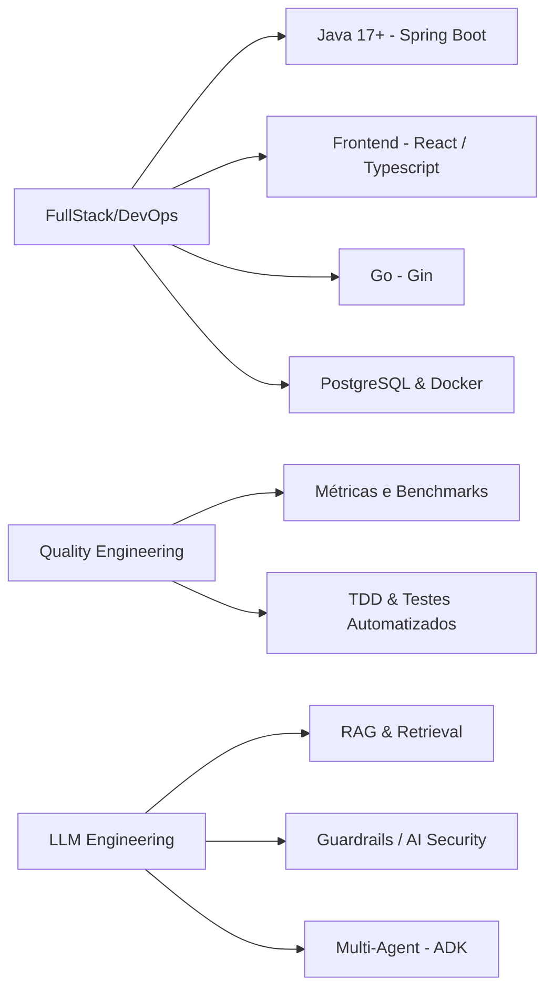

---

<div align="center">

[;Tech+Lead+%40+QA+Agent+-+PDC%2FCEIA-UFG;RAG%2C+Multi-Agent+Systems+%26+Guardrails)](https://git.io/typing-svg)


[](https://github.com/Rangelzin?tab=followers)
[](#-contatos)

</div>

&nbsp;

<p align="center" style="margin-bottom:10px; padding: 10px">
I'm a Software Engineering Student at UFG  <br><br>
Software engineer with a passion for solving complex problems through technology. I like to balance my career between technical skills and efficiency, so I'm looking for experience coordinating projects, analyzing and continuously improving software, integrating all of this with the fundamentals of agile and quality development.
</p>

&nbsp;

## 🔭 Atuação Atual

- 🧠 **LLM Engineer @ Cognifyx** — projeto **JURIS-IA**: pipelines de **RAG** sobre jurisprudência, redução de alucinação e otimização de tokens.
- 🛡️ **Tech Lead @ QA Agent** — PDC/CEIA-UFG: agente autônomo de QA, **guardrails** de segurança, sandbox de execução e métricas de qualidade.
- 🌱 Estudando: `LangGraph`, `CrewAI`, `Google ADK`, avaliação de LLMs (BERTScore, benchmarks e datasets sintéticos).
- 🤝 Aberto a colaborar em: **Sistemas Multiagentes**, **RAG aplicado a domínios regulados** e **QA automatizado com IA**.
- 💬 Pergunte-me sobre: `Java/Spring`, `Go`, `RAG`, `Prompt Injection & Guardrails`, `TDD`.
- ⚡ Fun fact: rodo **Fedora + Hyprland** com a barra ricada na mão — se quebrar, eu conserto no `zsh`.

&nbsp;

## 🧩 Como eu penso engenharia

```text
Clean Code  ·  SOLID  ·  TDD  ·  Observabilidade  ·  Automação estratégica
```

> Código sem teste é hipótese. Agente sem métrica é achismo.

&nbsp;
---

## 🗺️ Áreas de Foco


&nbsp;
---

## 🛠️ Stack Principal

<div align="center">

| Categoria | Tecnologias |
|:---:|:---|
| **Linguagens & Backend** | [](https://skillicons.dev) |
| **Frontend** | [](https://skillicons.dev) |
| **IA & Agentes** |   |
| **Banco de Dados** | [](https://skillicons.dev) |
| **Ferramentas & DevOps** | [](https://skillicons.dev) |
| **IDEs & Design** | [](https://skillicons.dev) |

</div>

&nbsp;
---

## 📊 GitHub Stats Extended

<div align="center">

<a href="https://github.com/stats-organization/github-stats-extended">
  
</a>
<a href="https://github.com/stats-organization/github-stats-extended">
  
</a>

<br/>

<a href="https://github.com/stats-organization/github-stats-extended">
  
</a>

</div>

&nbsp;

## 🚀 Projetos em Destaque

<div align="center">

<a href="https://github.com/Rangelzin/SGA-Central-POO">
  
</a>
<a href="https://github.com/Rangelzin/RDU-IP-ES-2025">
  
</a>

<!--
Rangelzin: duplique o bloco acima trocando o parâmetro repo= para fixar
mais projetos (ex.: algo público de agentes/RAG quando você abrir um).
-->

</div>

&nbsp;
---

## 📌 Fora do código

<div align="center">

`Fedora` · `Hyprland` · `Waybar` · `zsh` — meu ambiente é parte do meu setup de produtividade, e mexer em dotfiles é meu hobby de engenharia.

</div>

&nbsp;

## 📫 Contatos

<div align="center">

[](https://www.linkedin.com/in/rangel-zz/)
[](mailto:victorrangeltasse@gmail.com)
[](https://github.com/Rangelzin)
[](https://www.instagram.com/rangel_zz/)

</div>

